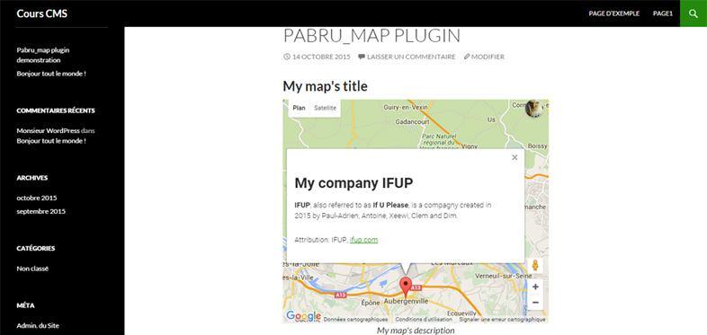

# CHARTY

Presentation
===========

plugin created as part of CMS workshop done in my school.

This plugin enables you to create and display customized geographic chart thanks to the google charts API.

**You can already choose/add :**
- your google maps API key (required)
- a geo chart title (required)
- a list of data and their associated labels
- a description of the chart
- Color axis to create a gradient on the geographic chart
- a background color for the chart
- the display mode of the elements (regions, markers, text...)
- the region you want to dislay in particulary (world, continent, sub-continents, countries)
- the event used to display the context boxes on the chart
- and other and other things...

**Version 1.0, soon you will have more choices and cool features !**
*This plugin is indeed destined to evolve !*

[Visit My Portfolio] (https://pa-bru.fr)

[Visit My Linkedin] (https://fr.linkedin.com/in/pauladrienbru)

Basic Usage
===========

1. Download the plugin on my github repository
2. Install and activate it in your wordpress
3. Click on *add a new chart*
4. Fill in the fields (make sure to create your google maps API key)
5. publish or update the geo chart
6. copy the shortcode shown like `[charty_shortcode id=x]`
7. Paste that one in the post/page you want to display the geographic chart

Example
===========

